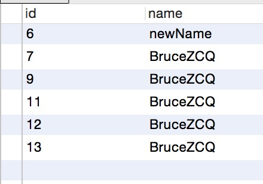
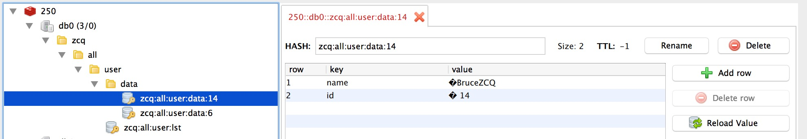
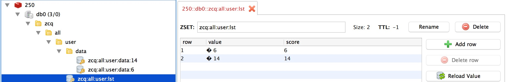

# JFinal-DbHelper
JFinal-DbHelper

继承了 JFinal 的牛逼，速度，简化的 JFinal 数据库操作，透明操作 Redis，让你全心安心做你的业务，数据缓存，统统把你解决掉。

核心组件
=======
- DbHelperKit: 封装了 JFinal DbKit，直接使用 Map 来装数据库的每一行数据;
- DbHelperTx: 简化了 Tx 操作;
- DataRecordModel: 数据库表的工具 Model, 继承这个 Model,加上和数据库字段一样的属性,你的牛逼 Db 操作之路就开始了;
- DBService: 提供了常见的 CRUD, 可以简单的 CRUD 同时把数据也“偷偷”的写到了 Redis 哦;

怎样使用
=======

- 假设你的表是这样的:

```sql
	CREATE TABLE `user` (
 	 `id` bigint(20) unsigned NOT NULL AUTO_INCREMENT, 
 	 `name` varchar(255) DEFAULT NULL,
 	 PRIMARY KEY (`id`),
  	 KEY `id` (`id`)
	) ENGINE=InnoDB DEFAULT CHARSET=utf8mb4
```

- 创建一个 Model:User, 她是这样的:

```java
@Table(name = User.TABLE)
public class User extends DataRecordModel<User> {

	private static final long serialVersionUID = 7098160284590588258L;

	public static final String TABLE = "user";
	public static final String TABLE_AS = "u";
	
	// SQL Fields
	public static final String ID = "id";
	public static final String NAME = "name";
	//SQL Field As
	public static final String ID_AS = "id";
	public static final String NAME_AS = "name";
	
	@Table.PrimaryKey
	@Table.Column(name = User.ID, as = User.ID_AS, originType = Table.ColumnOriginType.BIGINT)
	public String id;
	
	@Table.Column(name = User.NAME, as = User.NAME_AS, originType = Table.ColumnOriginType.STRING)
	public String name;
}
```
	
3. 接下来你再创建一个 Service,她是这样的:

```java
public class UserService extends DBService {

	private static final long serialVersionUID = -6341896364271284419L;

	//这里放自定义的其他方法
}
```

4.在加上一个 RedisCacheService, 她是这样的:

```java
public class UserRedisService extends RedisCacheService {

	private static final long serialVersionUID = 8673372135373269417L;

	//这里放自定义的其他方法
}
``` 

5.完成了上面的工作, 你就可以开始使用了哦:

```java
		//设置产品 name
		ProductKit.PRODUCT_NAME = "zcq";
		
		User user = new User();
		user.name = "Jobsz";
		
		//save
		UserService userService = new UserService();
		boolean ret = userService.save(user);
		System.out.println("save =="+ret);
		
		//find id = 6
		user.id = "6";
		Map<String, Object> find = userService.findOne(user);
		System.out.println("find =="+find);
		//find to User
		User otherUser = user.parser(find);
		System.out.println("other user == "+otherUser);
		//findall
		Object all = userService.findAll(user);
		System.out.println("findall =="+all);
		//update Jobsz to newName
		user.name = "newName";
		ret = userService.update(user);
		System.out.println("update =="+ret);
		//delete id = 10
		user.id = "10";
		ret = userService.delete(user);
		System.out.println("delete=="+ret);
```

6.最后是怎样的？
  	
  	
  	